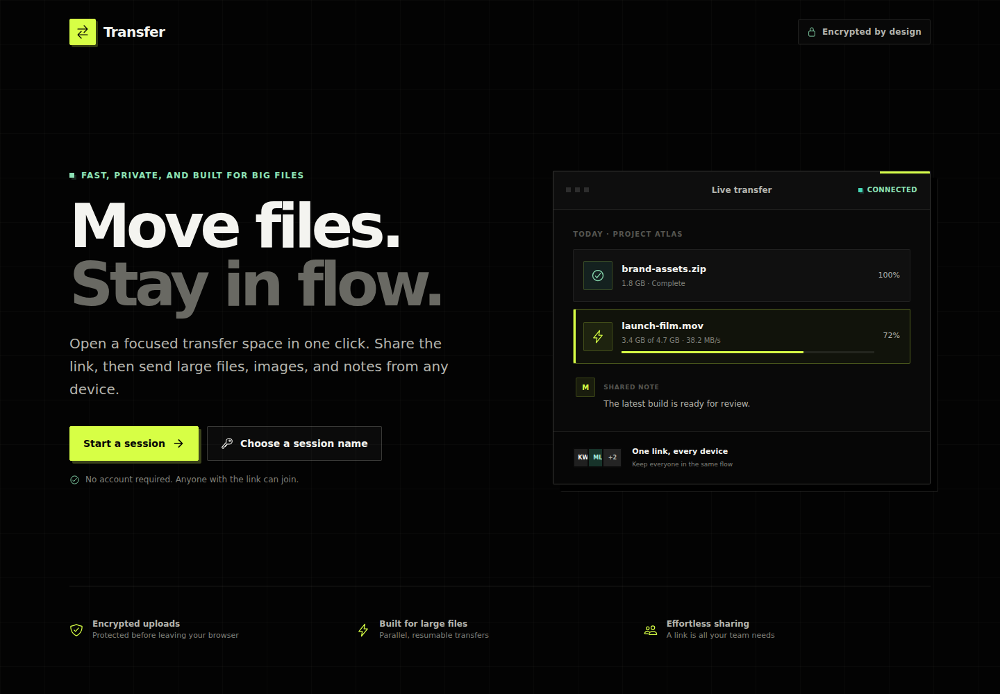
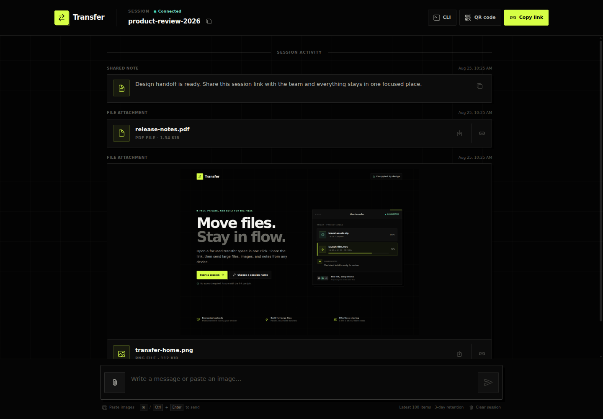
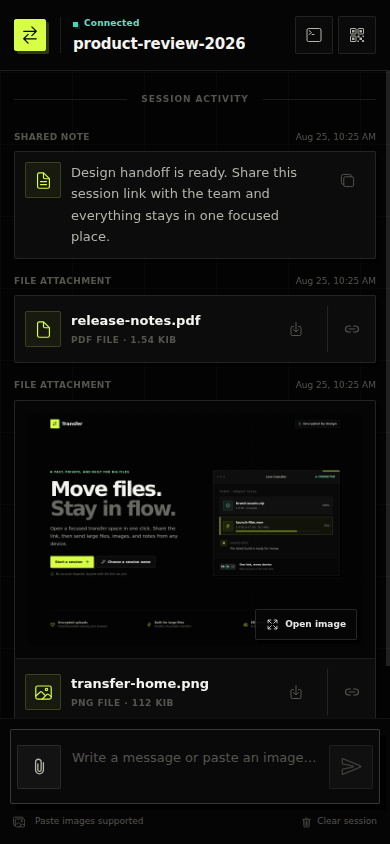

# Transfer

An account-free, self-hosted space for moving files, images, and notes between
devices. Create a session, share its link, and everything appears in real time.

> Web 版免登录文件传输助手 — a lightweight, self-hosted web file-transfer
> assistant.



## Highlights

- Parallel, resumable large-file uploads with bounded browser and server memory
- Multiple-file queue with live size, progress, speed, and ETA
- Image paste, contained image previews, and separate view/download actions
- Real-time sessions with share links, QR codes, and no account setup
- Folded long messages, pending-send feedback, and responsive desktop/mobile UI
- Direct curl API and a Streamable HTTP MCP endpoint for automation
- Automatic cleanup of old messages, files, and abandoned upload chunks



<p align="center">
  
</p>

## Quick start

```sh
mkdir -p data
docker run -d \
  --name transfer \
  --restart unless-stopped \
  -p 6611:6611 \
  -v "$PWD/data:/app/data" \
  docker.io/kevinwang15/transfer:latest
```

Open <http://localhost:6611>, start a session, and send its link or QR code to
the other device. The `data` mount contains the SQLite database, completed
files, and resumable-upload state; keep it on persistent storage.

For an internet-facing deployment, put Transfer behind an HTTPS reverse proxy,
enable WebSocket forwarding for Socket.IO, and allow request bodies at least as
large as your configured maximum chunk size plus protocol overhead.

## Browser upload behavior

The browser uploader keeps whole large files out of server memory:

1. The browser splits a file into chunks (4 MiB by default), encrypts each
   chunk in an authenticated AES-GCM envelope, and uploads up to three chunks in
   parallel.
2. Every upload operation uses the same opaque `POST /u` endpoint. Routing and
   resume metadata stays inside the encrypted envelope, and requests and
   responses are padded.
3. The server streams incoming requests and persists accepted chunks under
   `data/upload-chunks/` instead of retaining the whole file in memory.
4. Once every chunk is present, the server streams them into the completed file
   under `data/file-uploads/` and removes temporary state.
5. If the transfer is interrupted, selecting the same file again in the same
   browser and session resumes chunks already accepted by the server.

Files selected together are queued one at a time; chunks within the active file
are transferred in parallel. Failed chunks retry with bounded exponential
backoff. Abandoned request files, chunks, and resume markers expire after three
days by default.

## Security model

- Treat a session URL as a capability secret: anyone who knows the session ID
  can read its retained history, post to it, or clear it.
- Browser message sends and special uploads use application-layer authenticated
  encryption. This makes the upload exchange opaque to passive request
  inspection, but session history and attachment downloads use regular HTTP
  responses, and the browser encryption material ships with the application.
  It is **not end-to-end encryption** and does not replace HTTPS.
- The Transfer server decrypts browser traffic and stores messages and completed
  files unencrypted on disk. The server operator and anyone with access to the
  `data` volume can read them.
- The curl and MCP interfaces are direct server APIs and do not use the browser
  upload envelope. Always use HTTPS over untrusted networks.
- Browser-origin requests to `/mcp` are rejected as a cross-site safeguard, but
  the MCP endpoint has no separate authentication layer. Restrict access at the
  network or reverse-proxy layer when needed.

## Curl API

The curl API is useful for scripts and deliberately remains a regular multipart
upload interface. Replace the base URL and session ID as needed.

```sh
BASE_URL=http://localhost:6611
SESSION_ID=my-session

# Send text
curl -X POST \
  -F "text=hello from curl" \
  -F "sessionId=$SESSION_ID" \
  "$BASE_URL/text"

# Upload a file; optional `name` controls the displayed filename
curl -X POST \
  -F "file=@./example.pdf" \
  -F "name=release-notes.pdf" \
  -F "sessionId=$SESSION_ID" \
  "$BASE_URL/file"

# Read retained session history
curl "$BASE_URL/sessions/$SESSION_ID/history"

# Permanently delete the session history and its uploaded files
curl -X DELETE "$BASE_URL/sessions/$SESSION_ID/history"
```

The file-upload response contains `success`, an absolute `url`, `accessKey`, and
`messageId`. URLs for supported image types open inline by default; append
`download=1` to force a download. Other file types download by default.

## MCP

AI agents can connect to the Streamable HTTP endpoint at:

```text
https://transfer.example.com/mcp
```

The endpoint exposes four tools:

| Tool                  | Purpose                                      |
| --------------------- | -------------------------------------------- |
| `send_text`           | Send a text message to a session             |
| `upload_file`         | Upload base64-encoded content up to 10 MiB   |
| `get_session_history` | Read retained messages and attachment URLs   |
| `clear_session`       | Permanently remove a session's retained data |

MCP client configuration varies, but a URL-based configuration commonly looks
like this:

```json
{
  "mcpServers": {
    "transfer": {
      "url": "https://transfer.example.com/mcp"
    }
  }
}
```

Use the browser uploader or curl API for files larger than the MCP 10 MiB
limit.

## Retention and storage

Transfer keeps the newest 100 messages in each session for up to three days.
The periodic retention sweep removes expired database rows and their completed
files. Incomplete browser uploads are cleaned independently on the same default
three-day horizon.

| Path                    | Contents                                      |
| ----------------------- | --------------------------------------------- |
| `data/db.sqlite3`       | Session messages and file metadata            |
| `data/file-uploads/`    | Completed uploaded files                      |
| `data/upload-chunks/`   | Resumable browser-upload chunks and manifests |
| `data/upload-requests/` | Temporary encrypted request bodies            |

Allow enough free space for active chunks and the final file while a merge is
in progress.

## Configuration

| Variable                          |    Default | Purpose                                           |
| --------------------------------- | ---------: | ------------------------------------------------- |
| `PORT`                            |     `6611` | HTTP server port                                  |
| `UPLOAD_CHUNK_SIZE_BYTES`         |  `4194304` | Padded browser chunk size                         |
| `UPLOAD_MAX_CHUNK_SIZE_BYTES`     | `16777216` | Largest chunk the server accepts                  |
| `UPLOAD_CONCURRENCY`              |        `3` | Parallel chunk requests per browser upload        |
| `UPLOAD_DECRYPTION_CONCURRENCY`   |        `2` | Chunks decrypted concurrently by a server process |
| `UPLOAD_STALE_TTL_SECONDS`        |   `259200` | Age at which abandoned upload state is deleted    |
| `UPLOAD_CLEANUP_INTERVAL_SECONDS` |     `3600` | Stale-upload sweep interval                       |
| `MESSAGE_PRUNE_INTERVAL_SECONDS`  |       `60` | Completed-message retention sweep interval        |

## Development

Transfer requires Node.js 20 or newer.

```sh
npm ci

cd api
npm link
cd ..
npm link @transfer/api

mkdir -p data
```

Run the backend and frontend in separate terminals:

```sh
# Terminal 1 — API and Socket.IO on port 6611
node --watch server/index.js

# Terminal 2 — development UI on port 3000
npm run start-frontend
```

Then open <http://localhost:3000>. The development UI connects to the backend
at `http://localhost:6611`.

```sh
# Run the test suite
npm test

# Build the frontend into server/frontend
npm run build

# Start the production server from the build output
npm run start-server
```
